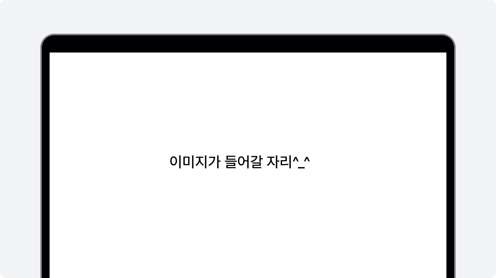

# 학급 PDF 업로드
선생님 PDF 일괄 업로드를 선택하신 경우, 학급 단위로 스캔한 과제 파일을 준비해 주세요.

과제 제출 현황의 '학급 PDF 업로드'를 클릭해 주세요.

스캔한 파일을 업로드하고 페이지 분할을 설정해주세요.

설정에 따라 PDF 파일을 분할하여 학생별로 업로드 돼요.

:::info 학생용 클리포 과제 제출
학생용 클리포의 과제 제출은 [이곳에서](/docs/manualS/assessment/submit.md) 확인할 수 있습니다.
:::