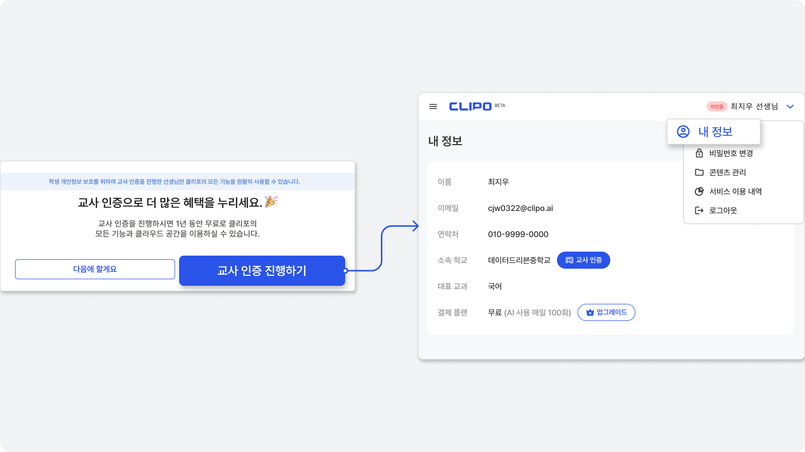
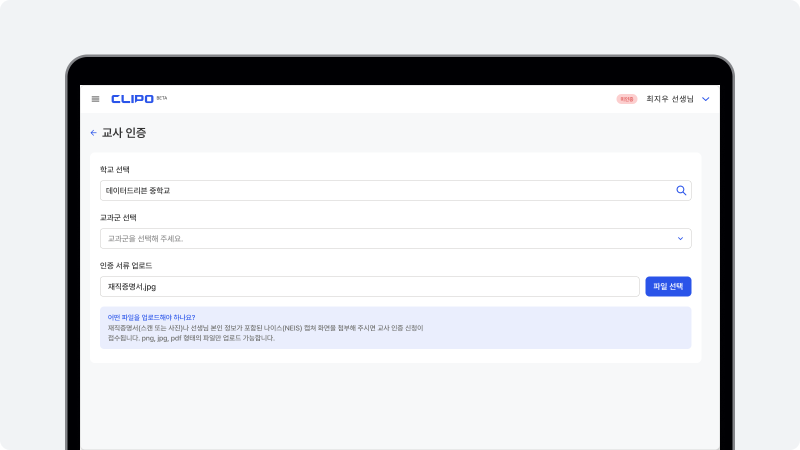
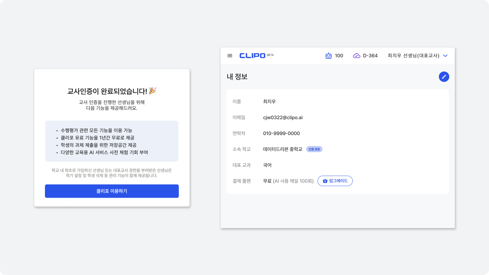

# 교사 인증

## 교사 인증 진행하기

로그인 후, 안내되는 팝업에서 '교사 인증 진행하기' 버튼을 눌러 주세요.

개인정보보호를 위해 교사 인증을 진행해 주세요.

교사 인증이 완료되면 수행평가 기능을 비롯한 클리포의 모든 기능을 이용할 수 있어요.

::: info
안내되는 팝업을 놓쳤다면, 로그인 후, 오른쪽 상단 메뉴 '내정보'에서도 교사 인증을 완료할 수 있습니다.
:::

## 교사 인증 요청

교사 인증을 위한 증빙서류를 업로드해 주세요.

학교와 교과군을 선택한 후, 재직증명서(스캔) 또는 나이스 접속 화면을 업로드 해주세요.
::: info
나이스 접속화면은 선생님 이름, 학교명, 캡처 일시가 함께 표시되어야 해요.
:::

교사 인증 요청 내용을 학교 대표교사 또는 클리포 운영진이 확인하여 요청일로부터 3일 이내 인증 결과를 알려드려요

::: tip 팁
담당 교과가 여러갱니 경우 어떻게 하나요?
대표 교과 1개를 선택해 주세요. 교과군 추가 등록이 필요한 경우, [고객센터](https://clipo.ai/teachers/helps/questions)에 문의글을 남겨주세요.
:::

## 교사 인증 완료
교사 인증 신청 결과는 이메일로 알려드립니다.

교사 인증 완료 후, 로그인하면 인증 완료 팝업을 확인할 수 있어요.
내 정보에서도 교사 인증 여부를 확인할 수 있어요. 

