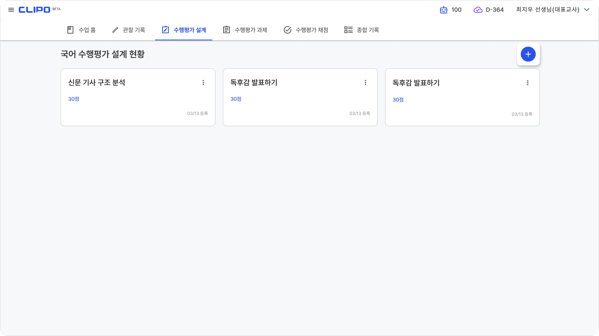
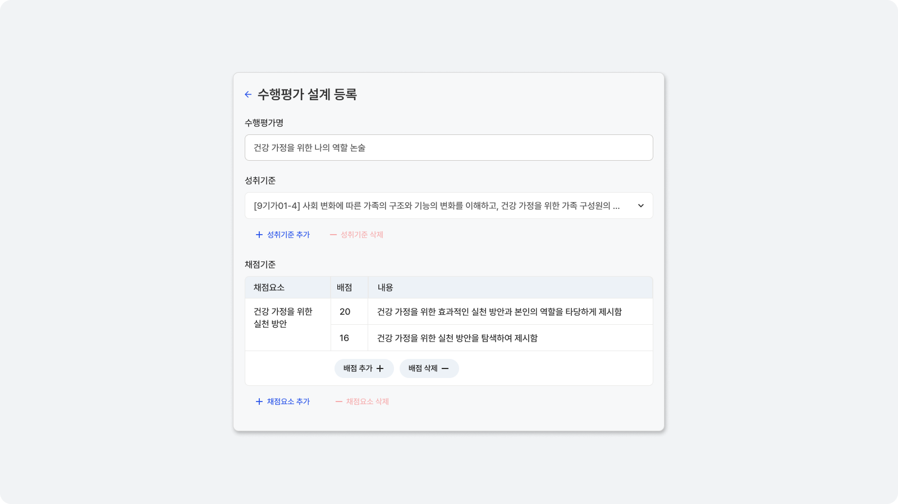
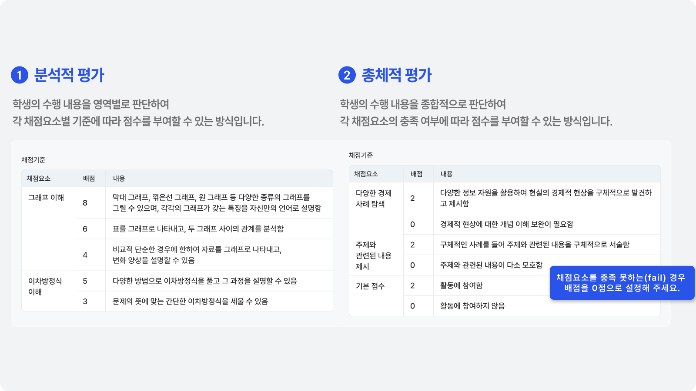
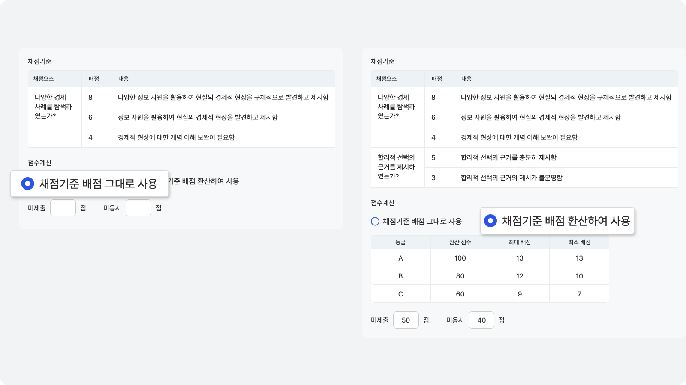

# 수행평가 설계

## 수행평가 등록
수업에서 진행할 수행평가를 등록해 주세요.

아직 등록한 수행평가가 없다면 +를 클릭해서 새로운 수행평가 설계 내용을 등록할 수 있어요.

## 채점 기준 입력 <Badge type="tip" text="AI Assistant 자동 채점" />
성취기준을 선택하고, 채점기준을 작성해 주세요.

:::tip AI Assistant 자동 채점이 계속 개선될 예정이에요.
서술형 이외의 다양한 수행평가 과제 유형을 지원하기 위해 AI Assistant 자동 채점 기능을 계속 연구 개발하고 있어요.
:::

## 채점 기준 작성 예시

:::tip AI Assistant 자동 채점을 활용하신다면?
클리포에서는 다양한 유형의 설계와 채점을 지원하지만, AI Assistant 자동 채점은 분석적 평가로 채점할 때 더 정확한 결과가 나와요.
:::

## 점수계산 방식 설정
원하는 점수계산 방식을 설정할 수 있습니다.

채점 기준 배점을 그대로 사용하거나 등급별 점수로 환산할 수 있어요.
미제출/미응시 점수도 설정할 수 있어요.

:::details 점수계산 세부내용
'채점기준 배점 그대로 사용'을 누를 경우, 채점기준에서 입력한 점수 그대로 채점을 진행합니다. 

'채점기준 배점 환산하여 사용'을 누를 경우, 등급별 배점 구간에 맞춰 입력된 환산 점수가 부여됩니다.
:::