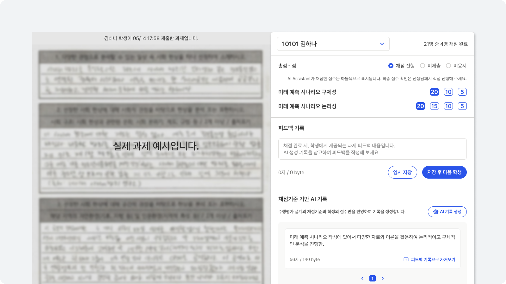
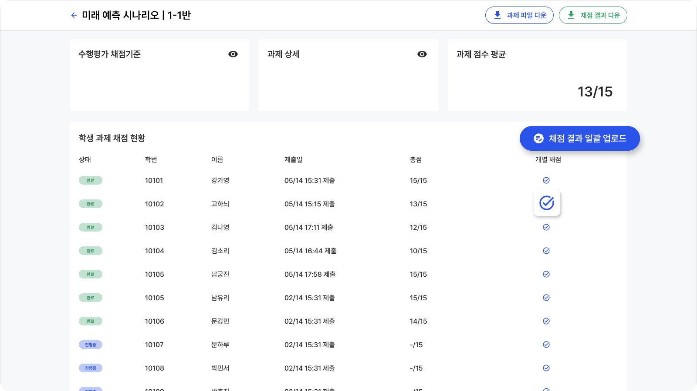

# 수행평가 채점

## 채점
채점을 진행할 과제와 학급을 선택해 주세요.

<!-- 

 -->

수행평가 채점에서 전체 채점 현황을 확인하고, AI Assistant 자동 채점 또는 수동 채점으로 과제 채점을 진행할 수 있어요.

## 학생별 채점 <Badge type="info" text="수동 채점" />
수행평가 설계 내용에 따라 학생별 채점을 진행할 수 있습니다.
AI Assistant의 도움을 받아 채점기준 기반 피드백을 작성할 수 있습니다.

:::tip 채점기준 기반 AI 기록은 무엇인가요?
채점기준 기반 AI 기록은 수행평가 설계에서 입력해주신 채점요소별 평가기준을 기반으로 과제물 분석없이 성취수준에 대한 내용으로 이뤄진 기록입니다.
:::

## 학급 채점 현황
채점 목록에서 채점 상세를 눌러 학급 채점 현황을 확인할 수 있습니다.
개별 채점을 눌러 학생별 채점을 진행하거나 학급 전체 채점 결과를 일괄 업로드 할 수 있습니다.

