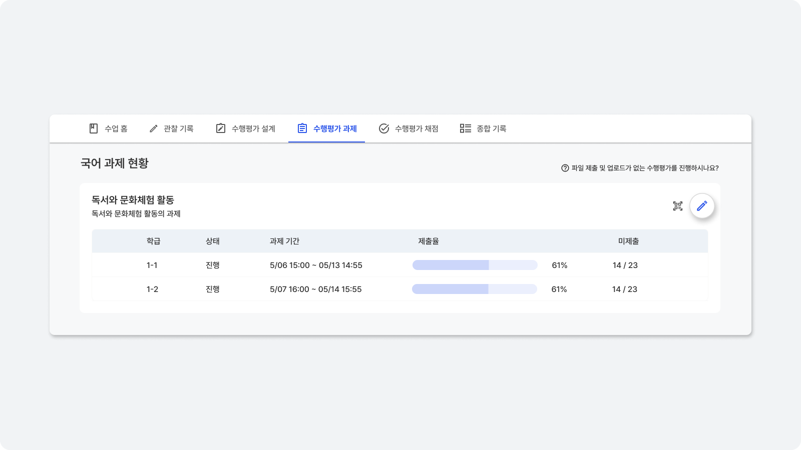
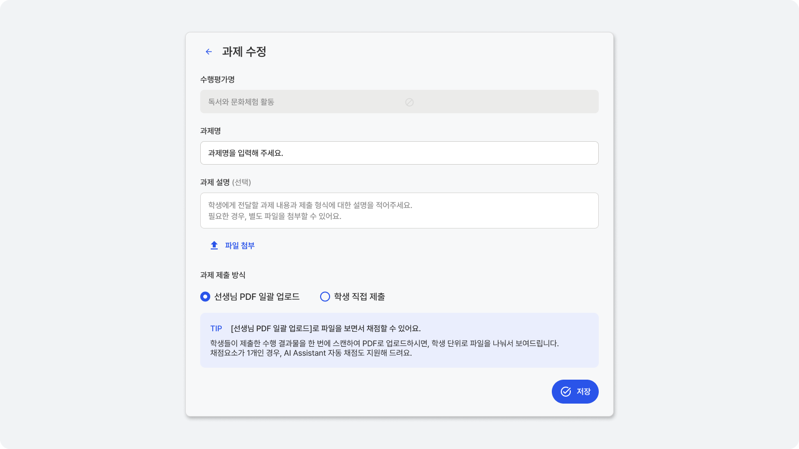
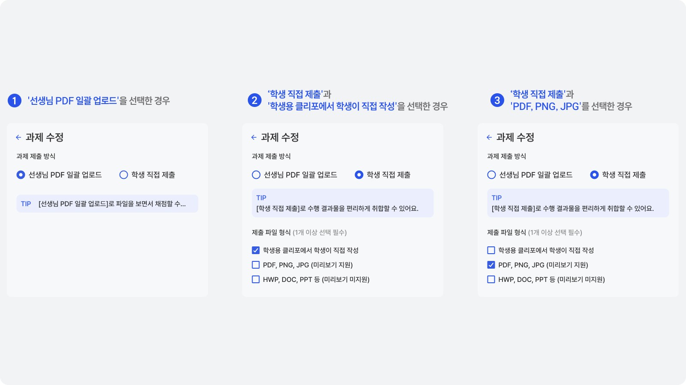

# 수행평가 과제 등록
등록한 수행평가 설계 내용에 따라 과제가 자동으로 생성됩니다.

'수행평가 과제' 화면에서 생성 버튼을 클릭하면 과제 세부 내용을 작성할 수 있어요.

::: tip 학생의 과제나 수행 결과물 제출없이 채점만 진행하고 싶다면?
수행평가를 설계하셨다면 '수행평가 채점'으로 이동해서 채점을 바로 진행할 수 있습니다.
:::

## 과제 내용 및 형식 설정
학생에게 부여할 과제 내용과 제출 방식을 설정해 주세요.

선생님 PDF 일괄 업로드를 선택하면 학생이 직접 제출하지 않고, 선생님 학생의 수행 결과물을 일괄 스캔하여 업로드할 수 있어요.
학생 직접 제출을 선택하면 학생이 클리포 계정에 로그인해서 파일을 업로드 할 수 있어요.

## 자동 채점을 위한 과제 형식 설정 <Badge type="tip" text="AI Assistant 자동 채점" />
AI Assistant 자동 채점을 이용할 수 있는 조건입니다.

:::tip AI Assistant 자동 채점은 계속 개선됩니다. ('24년말까지)
AI Assistant가 지속적으로 수행평가 설계와 과제를 학습해서 더 많은 과제 형식을 지원할 예정입니다.
:::