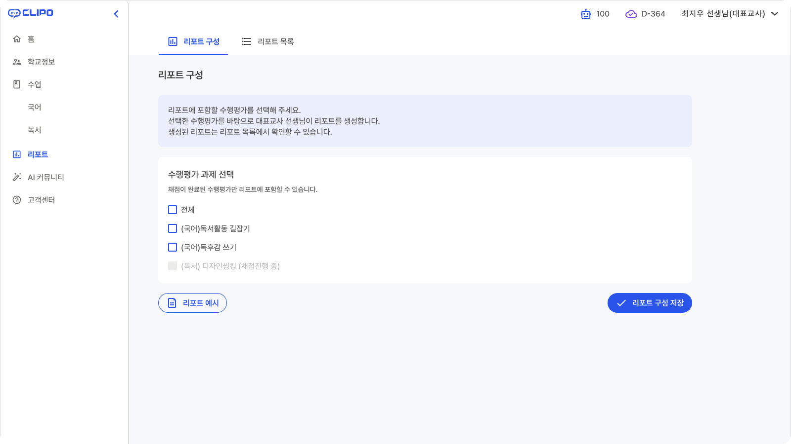
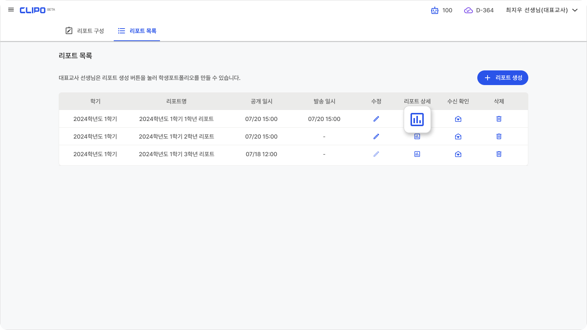

# 리포트

## 리포트 구성
리포크에 포함할 과제를 선택합니다.
리포트 생성은 대표교사 선생님만 가능합니다.

:::tip 리포트 예시를 확인할 수 있어요.
리포트 예시를 클릭하면 리포트 샘플을 확인할 수 있습니다.
:::

## 리포트 목록
대표교사 선생님이 생성한 리포트를 확인할 수 있습니다.
리포트 상세 버튼을 클릭하면 생성된 리포트를 확인할 수 있어요.

## 리포트 생성 <Badge type="tip" text="대표교사" />
전 과목 수업에 대한 종합 리포트를 생성할 수 있습니다.

대상 학기와 리포트명, 공개 일시를 설정해 주세요.
리포트 공개 시점 전까지 각 수업에서 입력된 수행평가 결과가 반영됩니다.

리포트에 구성될 과제와 공개 대상을 선택해 주세요.

리포트에 포함될 과제와 학급/학생을 선택할 수 있어요.
선택이 불가능한 과제는 각 수업 담당 선생님께 문의하여 리포트 구성 선택여부를 확인해 주세요.
