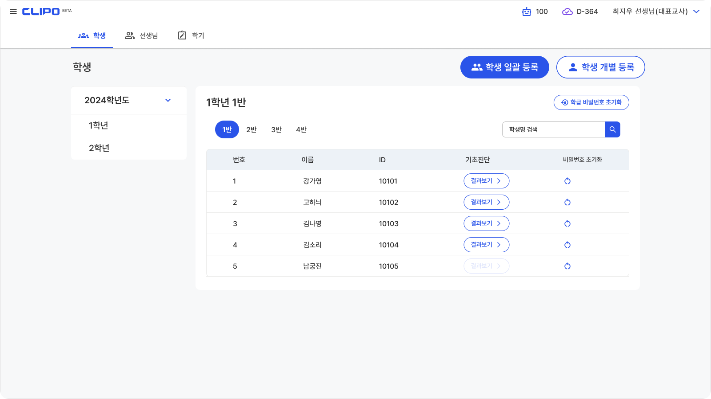
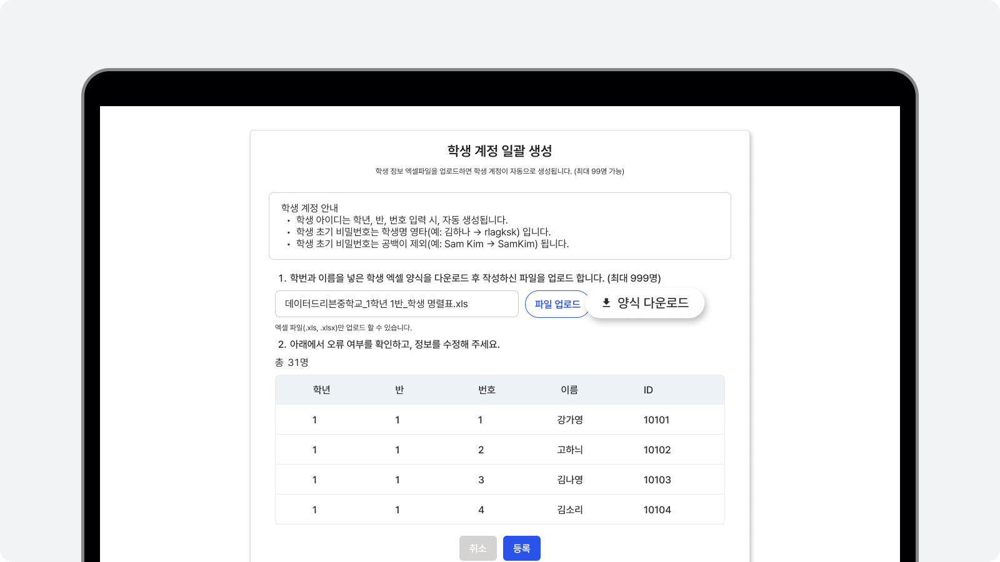
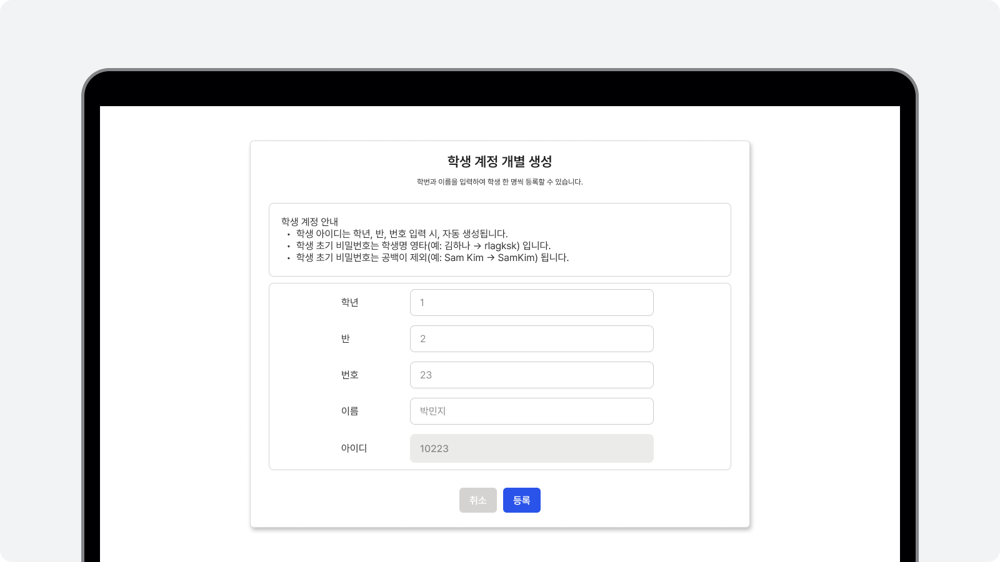
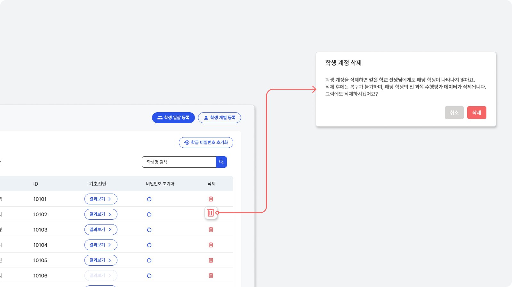
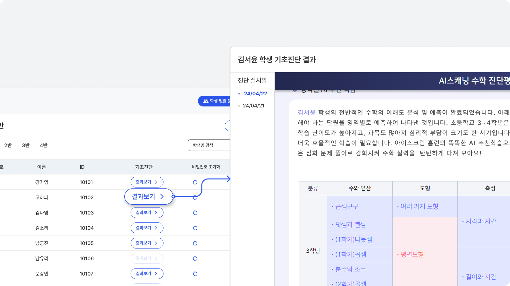

# 학생 관리

## 학생 등록
학생을 등록하여 계정을 생성하면 학생용 클리포 ID가 자동으로 부여됩니다.

학생 계정 생성은 파일 업로드를 통한 '일괄 생성'방식과
직업 입력을 통한 '개별 생성' 방식이 있어요.

## 학생 계정 일괄 생성

학생 계정 일괄 생성을 위한 엑섹파일 양식을 제공합니다.

다운받은 엑셀파일에 학생 정보를 입력 후, 파일을 업로드 해주세요.
입력된 학생 정보를 확인 후, 등록을 클릭하면 학생 계정이 일괄 생성돼요.

## 학생 계정 개별 생성

등록할 학생 정보를 입력해 주세요.
학생 정보를 입력하면 아이디는 자동으로 만들어져요.
'등록'을 클릭하면 학생 계정이 생성돼요.

<!-- ## 학생 계정 비밀번호 초기화
학생 계정의 비밀번호를 선생님이 초기화 할 수 있습니다.

학생 계정의 초기 비밀번호는 학생명 영타입니다.
비밀번호 초기화 버튼을 눌러 학생 계정의 초기 비밀번호를 학급/학생 단위로 초기화 할 수 있어요. -->

## 학생 계정 삭제 <Badge type="tip" text="대표교사" />
필요한 경우 학생 계정을 삭제할 수 있습니다.

학생 계정을 삭제할 경우 해당 학생의 모든 데이터가 사라져요.
학생 계정 삭제는 꼭 필요한 경우에만 신중히 이용해주세요.

:::danger 학생 계정 삭제 시, 관련 데이터가 모두 소실되고 복구되지 않습니다.
학생 계정 삭제 시, 해당 학생의 모든 데이터(과제 평가 점수와 결과 등)가 다른 선생님의 계정에서도 삭제되며, 복구가 불가능합니다. 
학생 삭제에 유의해 주세요.
:::

## 학생 기초진단
초등학교/중학교 수학 과목에 대한 기초진단을 무료로 제공합니다.
계정이 생성된 학생은 학생 로그인 후, 기초진단을 실시할 수 있어요.
초등학교/중학교 수학 과목 기초진단은 학년 수준에 따라 15개 내외의 문항으로 이뤄져 있어요.

:::info 참고
기초진단 기능은 아이스크림에듀와 제휴해서 제공해요.
:::